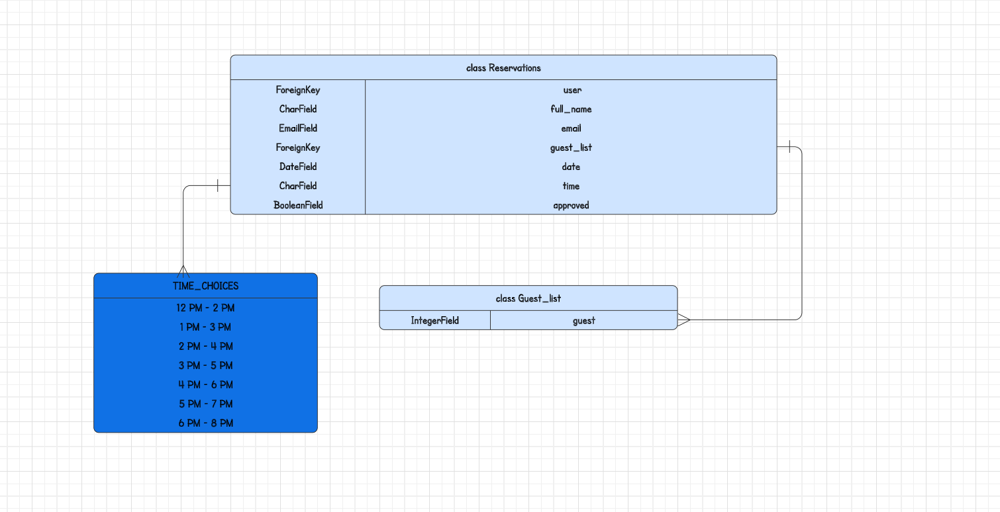
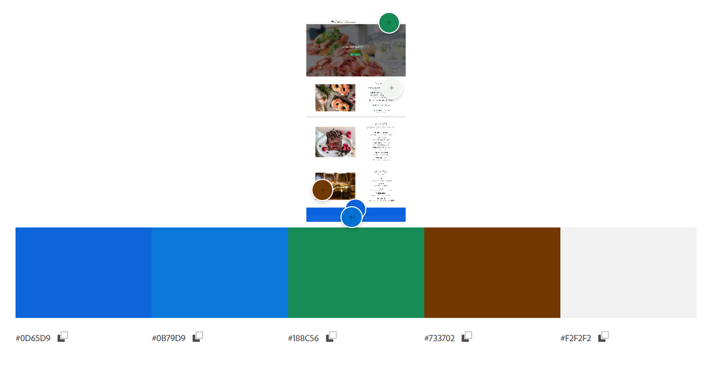

# West Coast Restaurant:
[My live project](https://west-coast-restaurant-901306ae347b.herokuapp.com/)

# Table of content:
- [User Experience (UX)](#user-experience-ux)
  - [UX principle](#ux-principle)
  - [USER STORY](#user-story)
- [Features](#features)
  - [Existing features](#existing-features)
- [Design](#design)
  - [Chart](#chart)
  - [Color](#color)
  - [Wireframe](#wireframe)
- [Testing](#testing)
  - [User Story Testing](#user-story-testing)
  - [Manual testing](#manual-testing)
  - [Testing on desktop](#testing-on-desktop)
  - [All tests were also performed on](#all-tests-were-also-performed-on)
  - [Known bugs](#known-bugs)
- [Deployment](#deployment)
  - [Create a Heroku app](#create-a-heroku-app)
  - [Creating a repository on github](#creating-a-repository-on-github)
  - [Comprehensive guide on cloning the respository](#comprehensive-guide-on-cloning-the-repository)
- [Technologies Used](#technologies-used)
- [Credits](#credits)
  - [Content](#content)
  - [Code](#code)
  - [Media](#media)
- [Acknowledgements](#acknowledgements)

## User Experience (UX):
### UX principle:

- as a user, it is easy to register on "sign up for free" and book a restaurant visit.
- as a user, it is easy to book a table after the user has registered and book a table on "make a reservation"
- as a user, it is easy to check which bookings have been made on "reservations detail".
- as a user it is easy to see the menu on the first page "homepage".
- as a user, it is easy to log in and log out using the "login/logout" button.
- as a user, you can see who made the page and see the address on the "footer".
- as a user, the wine list and desserts are also visible on the same page as the menu on the "home page" a little further down.
- as a user, it is easy to get to the homepage by clicking on "home" at the top left.
- as a user, the user are welcomed with the first thing that appears "Welcome to West Coast Restaurant
ALWAYS FRESH SEAFOOD"
- as a user, it is easy to edit your bookings and delete the booking.
- as a user, you can see the price of all items on the menus and can easily choose according to wallet if desired
- as an admin, I can easily confirm bookings via the admin page.
- as an admin, it is easy to see how many tables are available.

### USER STORY

[Project board](https://github.com/users/blackcatten/projects/1/views/1) with my defined [USER STORIES](https://github.com/blackcatten/west-coast-restaurant/issues)  are available here:

- USER STORY: Account registration #1
  - As a **Site User** I can **register an account** so that **I can book a table**

- USER STORY: Edit and delete booking #2
  - As a **Site User** I can **edit and delete booking** so that **I can change the time**

- USER STORY: Navigation bar #3
  - As a **Site User** I can **use a navigation bar** so that **I can switch to other pages**

- USER STORY : Booking system #5
  - As a **Site User** I can **choose date and time** so that **I can implement a booking**

- USER STORY: Menu #6
 - As a **Site User** I can **check out the menu** so that **I can check what's available**

- USER STORY: Price #7
 - As a **Site User** I can **see the price** so that **I can calculate the price**

- USER STORY: Password #8
 - As a **Site User** I can **create mu own password** so that **I can log in**

- USER STORY: My booking table #9
  - As a **Site User** I can **go to a separate page** so that **I can see my reserved table**

- USER STORY: My booking table details #10
 - As a **Site User** I can **go to my booking page** so that **I can see all details of my booking table**

- USER STORY: Contact #11
 - As a **Site User** I can **see the address and phone number** so that **I can contact the restaurant**

- USER STORY: Home page #12
 - As a **Site User** I can **go to the home page** so that **I can see information and pictures of the restaurant**

## Features:
### Existing Features:

1. Navigation bar.

- Navigation bar for desktop.

- Navigation bar for ipad.

- Navigation bar for iphone.

2. Home Page.

3. Make a Reservation Page.

4. Reservations detail Page.

5. Login Page.

6. Logout Page.

7. Signup Page.

8. Alert Messages.

## Design:
### Chart:

### Color:

### Wireframe:

## Testing:
### User Story Testing:

[Project board](https://github.com/users/blackcatten/projects/1/views/1) with my defined [USER STORIES](https://github.com/blackcatten/west-coast-restaurant/issues)  are available here:

- USER STORY: Account registration #1
  - As a **Site User** I can **register an account** so that **I can book a table**
By clicking the "Sign up for free" button on the right side, a user can register and book a table.
- USER STORY: Edit and delete booking #2
  - As a **Site User** I can **edit and delete booking** so that **I can change the time**
On the 'Reservations detail' page, a user can see made reservations and two buttons: edit and delete. By clicking on the buttons, a user can delete a reservation or update by going to the 'update reservation' page and changing the reservation.
- USER STORY: Navigation bar #3
  - As a **Site User** I can **use a navigation bar** so that **I can switch to other pages**
Through the navigation bar, the user can go to the option "home", "Reservations detail", "Logout" when the user is logged in and "Make a Reservation" and "Login" and "Signup for free" when the user is not logged in.
- USER STORY: Footer layout #4
  - As a **Site User** I can **use the footer** so that **I can see the opening hours**
- USER STORY : Booking system #5
  - As a **Site User** I can **choose date and time** so that **I can implement a booking**
By filling in the 'Make a Reservation' form, the user can choose the date and time to make a reservation.
- USER STORY: Menu #6
 - As a **Site User** I can **check out the menu** so that **I can check what's available**
On the website there is a menu available for main dishes, desserts and drinks.
- USER STORY: Price #7
 - As a **Site User** I can **see the price** so that **I can calculate the price**
On the website there is a menu available for main dishes, desserts and drinks with prices.
- USER STORY: Password #8
 - As a **Site User** I can **create mu own password** so that **I can log in**
By clicking the "Signup for free" button, a user comes to a page to fill in the form and create a password.
- USER STORY: My booking table #9
  - As a **Site User** I can **go to a separate page** so that **I can see my reserved table**
By clicking the "Reservations detail" button, a user can see made bookings.
- USER STORY: My booking table details #10
 - As a **Site User** I can **go to my booking page** so that **I can see all details of my booking table**
By clicking the "Reservations detail" button, a user can see made bookings.
- USER STORY: Contact #11
 - As a **Site User** I can **see the address and phone number** so that **I can contact the restaurant**
On the footer, a user can find the address and phone number information to contact the restaurant.
- USER STORY: Home page #12
 - As a **Site User** I can **go to the home page** so that **I can see information and pictures of the restaurant**
On the home page a user can see the text "Welcome to West Coast Restaurant ALWAYS FRESH SEAFOOD" and the "Make a Reservation" button with a background image of shrimp plates.

### Manual Testing:

1. Validator HTML-pass

- Homepage- pass 

- Make a Reservation Page- pass

- Reservations Detail Page- pass

- Update reservations Page- pass

- Login Page- pass

- Logout Page- pass

2. Validator CSS-pass

3. Validator Python-pass

- admin.py booking_system- pass

- forms.py booking_system- pass

- models.py booking_system- pass

- urls.py booking_system- pass

- views.py booking_system- pass

- settings.py west_coast- pass

- urls.py west_coast- pass

#### Testing on desktop:
- All steps are performed in browsers:
    - Chrome - Version 111.0.5563.65 
    - Microsoft Edge - Version 111.0.1661.44 
    - Firefox - 111.0

1. NAVIGATION BAR:

 - Hover over each link has been made. The effect has been confirmed to be correct.
 - The Home page link has been pressed and confirmed to take the user to the Home page.
 - The 'Make a Reservation' page link has been pressed and confirmed to take the user to the correctly page.
 - The 'Reservations detail' page link has been pressed and confirmed to take the user to the correctly page.
 - The Sign Up and Log in/ Log out page link has been pressed and confirmed to take the user to the responsive page.

2. FOOTER:

 - It has been verified that the footer is displayed as expected.

3. HOME PAGE:

 - It has been confirmed that the main image on the site is clear and shows up after the page loads.
 - All pictures on the home page have been reviewed and verified to be the correct size.
 - It has been confirmed that the title and text are correct and display correctly.

4. MAKE A RESRVATION PAGE:

 - It has been confirmed that if a user submits a form without filling out the required fields, a message is shown to complete them.
 - It has been confirmed that it shows a message with a valid date if the user enters a name other the date in the date input field.
 - it has been confirmed that after completing the form correctly and pressing submit, the user will go to the reservations detail page.

 5. RESERVATIONS DETAIL PAGE:

 - The data that was entered into the form on the Make a Reservation page has been transferred to and displayed in the booking details on the reservations detail page.

 6. LOGIN PAGE:

 - It has been confirmed that the main image on the site is clear and shows up after the page loads.

 - It has been confirmed that the title and text are correct and display correctly and on correctly place.
 - It has been confirmed that the online booking page form is laid out as expected.
 - It has been confirmed that if a user submits a form without filling out the required fields, a message is shown to complete them.
 - It has been confirmed that it shows a message with a valid username if the user enters a name other the username in the username input field.
 - It has been confirmed that it shows a message with a valid password if the user enters a name other the password in the password input field.
 - It has been confirmed that after completing the form correctly and pressing submit, the user will go to the home page.

7. SIGN UP PAGE:

 - It has been confirmed that the main image on the site is clear and shows up after the page loads.
 - It has been confirmed that the title and text are correct and display correctly and on correctly place.
 - It has been confirmed that the online booking page form is laid out as expected.
 - It has been confirmed that if a user submits a form without filling out the required fields, a message is shown to complete them.
 - It has been confirmed that it shows a message with a valid e-mail address if the user enters a name other the e-mail address in the e-mail input field.
 - Confirmed to display a message with the correct password if the user enters a different password than the first time, or if the password does not match the required arrangement.
 - It has been confirmed that after completing the form correctly and pressing submit, the user will go to the home page.

8. LOGOUT PAGE:

 - It has been confirmed that the title and text are correct and display correctly and on correctly place.
 - The button works properly, and after pressing log out button, the user is logged out.

9. UPDATE RESERVATION PAGE:

 - It has been confirmed that the main image on the site is clear and shows up after the page loads.
 - It has been confirmed that the title and text are correct and display correctly and on correctly place.
 - It has been confirmed that the update reservation page form is laid out as expected.
 - It has been confirmed that if a user submits a form without filling out the required fields, a message is shown to complete them.
 - It has been confirmed that it shows a message with a valid date if the user enters a name other the date in the date input field.
 - It has been confirmed that after completing the form correctly and pressing submit, the user will go to the reservations detail page.

10. DELETE RESERVATION PAGE:

 - It has been confirmed that the delete reservation message is correct and display correctly.

### All tests were also performed on:
- Samsung Galaxy s21
- Lenovo Tab M8(4th Gen)

## Known Bugs:

- Signup Page.

## Deployment:

#### Create a Heroku app.
To create a Heroku application, after log in, on the main page should press the button: 'New'. Then you should select: 'Create new app'. On the next page, you should fill a form with the following data: 'App name' and 'Choose a region', and then press button: 'Create app'.

Once the Heroku app is created, the next step is to go to option: 'settings'. In the category 'Config Vars', the user should press 'Reveal Config Vars' button, and then enter the KAY and VALUE for individual properties of:

- DATABASE_URL:

- SECRET_KEY

- CLOUDINARY_URL

- DISABLE_COLLECTSTATIC (Value of DISABLE_COLLECTSTATIC should be 1)

- PORT (Value of PORT should be 8000)

#### Creating a repository on GitHub
Utilizing the GitHub Full Template, my project was initiated. Clicking the green dropdown located at the top right corner of the page, the option 'Use this template' was selected. Following that, the 'Create a new repository' button was chosen. Subsequently, you'll be redirected to another page where, under the 'Owner*' tab, your username should be selected, and under the 'Repository name*' tab, a name for your repository should be provided. Beneath that, within the 'Description (optional)' section, you have the opportunity to furnish your repository with a brief description. Below, there's an option to designate your repository as either private or public. Finally, once all necessary details are filled, the 'Create repository' button should be pressed.

On the GitPod Page, situated at the top right corner, there's a button labeled 'New Workspace'. Upon clicking that, a new workspace can be added. In the 'Select a repository' tab, you can paste the URL link to the previously created repository. Upon completion, hit the 'Continue' button, and the workspace will commence building. It may take a while for the workspace to fully establish. Next, you'll need to install Django and its supporting libraries:

Install Django and gunicorn via the following command in the terminal: 'pip3 install django gunicorn'
Install the necessary supporting libraries using the command: 'pip3 install dj_database_url psycopg2'
Incorporate Cloudinary Libraries with the command: 'pip3 install dj3-cloudinary-storage'
Generate a requirements file via the command: 'pip3 freeze --local > requirements.txt'
Create the project using the command: 'django-admin startproject PROJ_NAME .'
Establish an app using the command: 'python3 manage.py startapp APP_NAME'
Subsequently, create a new env.py file at the top level of the directory and configure the database:

Begin by importing the os library at the beginning of the env.py file with 'import os'.
Set the environment variables as follows:
os.environ["DATABASE_URL"] = "Paste the same value as pasted in Heroku Config Vars"
os.environ["SECRET_KEY"] = "Paste the same value as pasted in Heroku Config Vars"
os.environ["CLOUDINARY_URL"] = "Paste the same value as pasted in Heroku Config Vars"
Lastly, create a Procfile at the top level directory and input 'web: gunicorn PROJ_NAME.wsgi'.

Linking the Heroku application with the GitHub repository
Navigate to the Heroku page, locate and select your previously created application panel, then click on 'deploy'. Within the 'Deployment method' section, opt for 'Connect to GitHub'. Beneath, you'll encounter the field labeled 'Search for a repository to connect to'. Enter your GitHub username and repository name, then hit the 'Search' button. Below, you'll find your GitHub repository name along with a 'Connect' button. At this juncture, you have two choices: either opt for 'Automatic deploys' or 'Manual deploy'.

I've chosen the 'Manual deploy' option. Adjacent to the 'Choose a branch to deploy' field, select 'main' and proceed by clicking 'Deploy Branch'. Allow some time for the main branch to build up. Upon successful completion, you'll receive a message stating 'Your app was successfully deployed' alongside a 'View' button. Click on 'View' to observe the live project. - [My live project](https://west-coast-restaurant-901306ae347b.herokuapp.com/)

The final steps required for deploying the application:
Prepare the application for deployment on Heroku once all code changes have been finalized and tested on localhost.

Set the DEBUG flag to False in settings.py.
Configure 'X_FRAME_OPTIONS' in settings.py to 'SAMEORIGIN'.
Update the requirements.txt file using the command: 'pip3 freeze --local > requirements.txt'.
Remove the Config Vars 'DISABLE_COLLECTSTATIC' from Heroku.
Navigate to the Deploy tab on the Heroku dashboard for the application and initiate the deployment process by clicking on deploy branch.

#### Comprehensive guide on cloning the repository:
Visit the following page: [My live project](https://west-coast-restaurant-901306ae347b.herokuapp.com/)
Click on the 'Code' button and copy the HTTPS link provided.
Once you've launched the GitBush terminal, navigate to the desired directory where you intend to clone the repository.
To initiate the cloning process, type "git clone" followed by the copied URL into the command line and hit Enter.
Execute the command: pip install -r requirements.txt to install the necessary packages for the application.
In the settings.py file, set DEBUG=True to facilitate development and local execution of the application.
To push any local changes back to the repository, employ the following commands:
git add . (or filenames)
git commit -m "Briefly describe the changes made"
git push
Note: Any alterations pushed to the master branch will be reflected in the live project once the application is re-deployed from Heroku.

## Technologies Used:
HTML
CSS
PYTHON
JQUERY
Font Awesome 
Google Fonts 
Git 
GitHub 
Django 
Bootstrap 
Heroku 
Lucid Chart
Pep8 
Cloudinary 
PostgreSQL 
SQLite 
Django Allauth
Django Crispy Forms 

## Credits: 
### Content:

- [Menu content](https://fiskekrogen.se/meny/)
### Code:

- [MDB](https://mdbootstrap.com/docs/standard/extended/login/)- was used to login, logout and signup layout.
- [Django models](https://docs.djangoproject.com/en/4.1/topics/forms/modelforms/) and [Django views](https://docs.djangoproject.com/en/4.2/topics/class-based-views/) and [Django Forms](https://docs.djangoproject.com/en/4.2/ref/forms/) was used to create models.py, views.py and forms.py
- [Django Tutorial](https://www.geeksforgeeks.org/django-tutorial/) was used to learn django. 
### Media:

- [Background image- Homepage](https://images.pexels.com/photos/566344/pexels-photo-566344.jpeg?auto=compress&cs=tinysrgb&w=1260&h=750&dpr=1)
- [Menu- main dishes](https://images.pexels.com/photos/3957499/pexels-photo-3957499.jpeg?auto=compress&cs=tinysrgb&w=1260&h=750&dpr=1)
- [Munu- desserts](https://images.pexels.com/photos/3026804/pexels-photo-3026804.jpeg?auto=compress&cs=tinysrgb&w=1260&h=750&dpr=1)
- [Menu- drinks](https://images.pexels.com/photos/1123260/pexels-photo-1123260.jpeg?auto=compress&cs=tinysrgb&w=1260&h=750&dpr=1)
- [Login, Logout and Signup background image](https://images.pexels.com/photos/355808/pexels-photo-355808.jpeg?auto=compress&cs=tinysrgb&w=1260&h=750&dpr=1)

## Acknowledgements:
- Special thanks to my mentor who helped me to find bugs.