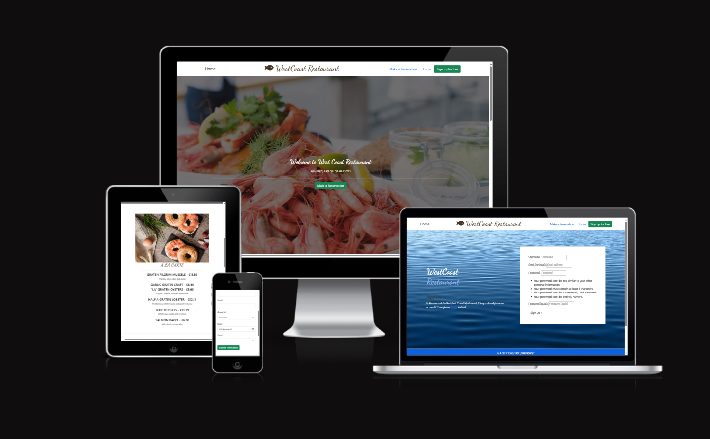
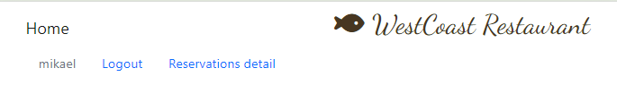
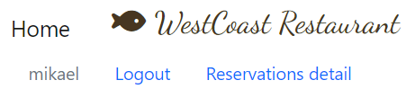
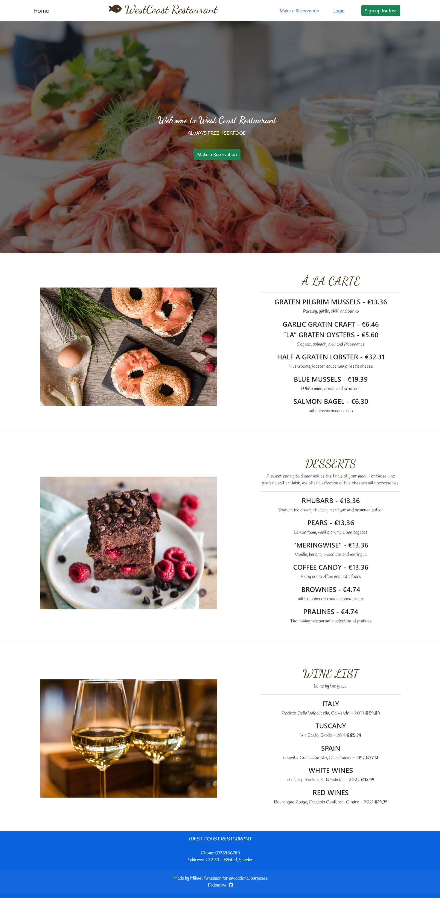
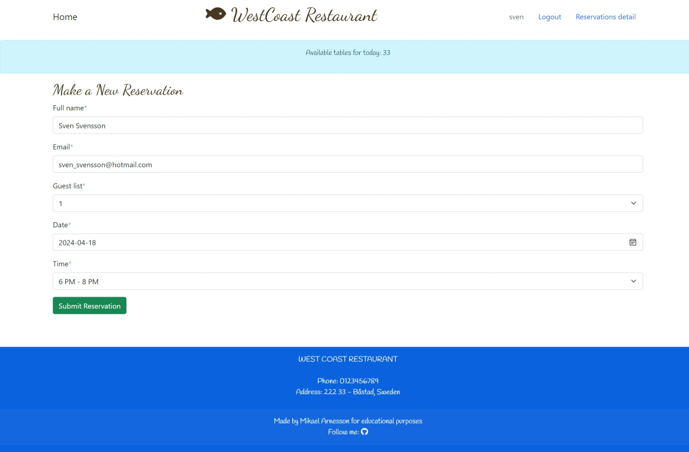
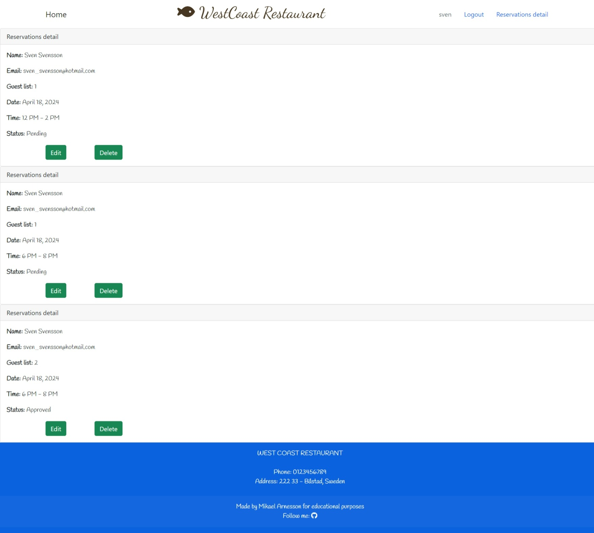

# West Coast Restaurant:
[My live project](https://west-coast-restaurant-901306ae347b.herokuapp.com/)

# Table of content:
## User Experience (UX):
### User Stories :
- as a user, it is easy to register on "sign up for free" and book a restaurant visit.
- as a user, it is easy to book a table after the user has registered and book a table on "make a reservation"
- as a user, it is easy to check which bookings have been made on "reservations detail".
- as a user it is easy to see the menu on the first page "homepage".
- as a user, it is easy to log in and log out using the "login/logout" button.
- as a user, you can see who made the page and see the address on the "footer".
- as a user, the wine list and desserts are also visible on the same page as the menu on the "home page" a little further down.
- as a user, it is easy to get to the homepage by clicking on "home" at the top left.
- as a user, the user are welcomed with the first thing that appears "Welcome to West Coast Restaurant
ALWAYS FRESH SEAFOOD"
- as a user, it is easy to edit your bookings and delete the booking.
- as a user, you can see the price of all items on the menus and can easily choose according to wallet if desired
- as an admin, I can easily confirm bookings via the admin page.
- as an admin, it is easy to see how many tables are available.

## Features:
### Existing Features:

1. Navigation bar.

- Navigation bar for desktop.

- Navigation bar for ipad.

- Navigation bar for iphone.

2. Home Page.

3. Make a Reservation Page.

4. Reservations detail Page.

## Typography:
## Design:
### Color:
### Wireframe:
## Testing:
### User Story Testing:
## Manual Testing:
## Known Bugs:
## Deployment:
## Deploying the app to Heroku:
## Technologies Used:
### Languages Used:
### Frameworks, Libraries and Programs Used:
## Credits: 
### Content:
### Code:
### Media:
## Acknowledgements: